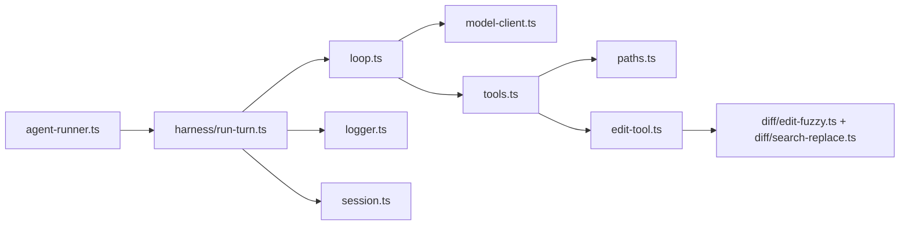

# GrokForge Harness Architecture

GrokForge uses one agent harness: a compact model → tools loop with direct disk tools and guarded `run_command` (user approval via main-process IPC). No proposal executor, plan router, or subagent path in v2 yet.

## Runtime Flow



`agent-runner.ts` is intentionally thin. It validates IPC payloads, tracks cancellation, checks API-key readiness, and calls `runAgentHarnessTurn()`.

## Tool Surface

The model can call only:

- `list_files` — list one directory level.
- `read_file` — read exact file contents and return `contentHash`.
- `write_file` — create or rewrite a file immediately.
- `edit` — apply targeted edits immediately, guarded by `expectedContentHash`.
- `run_command` — one-shot shell in a workspace root; **always** requires user approval (`command_approval_required` → `agent-command-approval-respond`).

`run_command` reuses policy/spawn/scaffold checks from `src/harness-support/tools/run-command-tool.ts`. Harness v2 only adds `tools/run-command.ts` (adapter) and `tools/tool-context.ts` (per-turn services boundary).

## Storage

Per-project logs and sessions currently stay in the validation-era app-data path:

```text
userData/workspace-projects/<projectId>/minimal/
  logs/<streamId>.jsonl
  sessions/<streamId>.jsonl
```

This path is intentionally retained for this migration so existing field-report logs and new harness logs are easy to compare.

Current log events include `turn_start`, `context_snapshot`, `model_step`, `tool`, `turn_done`, and `turn_error`.

Deferred observability from the removed legacy harness includes provider-round snapshots, retrieval previews, turn receipts, offload pointers, and harness intervention rows. Reintroduce those as focused harness v2 observability stories rather than restoring the old loop.

## Deferred Features

See `docs/harness-deferred-features.md` for features intentionally left out of the v2 loop and `docs/harness-prompt-visibility.md` for prompt/log visibility notes.
