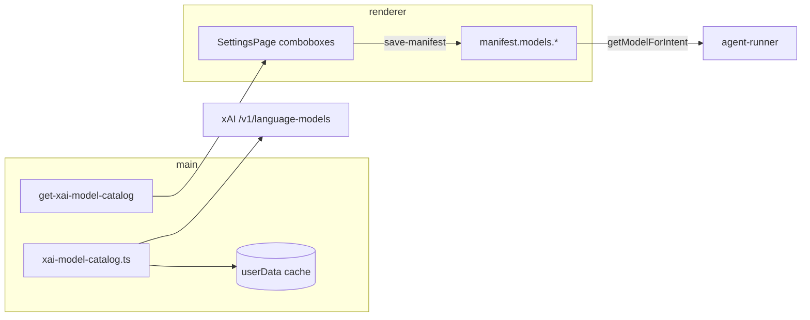

# 122 — Dynamic xAI model catalog and Settings picker

**Status:** Post-MVP backlog.

**Design skill:** Read [`.cursor/skills/styleguide-design/SKILL.md`](../../.cursor/skills/styleguide-design/SKILL.md) for Settings → Agent models (comboboxes, recommended badges, offline/refresh states, pricing hints).

**Depends on:** [**121**](121-xai-model-catalog-and-api-sync.md) (correct hardcoded fallbacks and docs first). Complements [**102**](102-dual-model-manifest-and-harness-foundation.md) / [**097**](097-model-routing-planner-vs-executor.md) — routing logic stays; this story changes **how users pick and discover** model ids.

**Blocks:** Nothing required, but reduces urgency of future “bump default model id” releases when xAI ships **Grok 5.0** or renames SKUs.

## Why this story exists

GrokForge today bakes xAI model ids into **`DUAL_MODEL_FALLBACKS`**, tests, and harness profile maps. **Settings → Agent models** is **read-only** (`AgentModelSlotRow` shows manifest values; users cannot change slots in-app). When xAI adds **`grok-5.0`**, renames aliases, or promotes **Grok Build** over legacy slugs, we currently need a **new app build** to update defaults and copy — even though the user’s API key may already have access to new models.

xAI exposes **Inference API model listing** scoped to the authenticating key:

| Endpoint | Use for GrokForge |
| --- | --- |
| [`GET /v1/language-models`](https://docs.x.ai/developers/rest-api-reference/inference/models) | Rich catalog: canonical `id`, **`aliases`**, modalities, pricing fields, `version`, `fingerprint` |
| [`GET /v1/models`](https://docs.x.ai/developers/rest-api-reference/inference/models) | Lighter list (all model types); fallback if language-models unavailable |
| [`GET /v1/models/{model_id}`](https://docs.x.ai/developers/rest-api-reference/inference/models) | Validate a manifest id on save / refresh |

Docs: [Inference REST API — Models](https://docs.x.ai/developers/rest-api-reference/inference/models).

**Product goal:** After [**121**](121-xai-model-catalog-and-api-sync.md) aligns our **recommended** defaults (e.g. **`grok-build-0.1`** for coding / execution), this story lets users **choose any model their key can see** from a live catalog — so when Grok 5.0 appears on the API, power users can select it **without waiting for a GrokForge release**.

## What a dynamic catalog does and does not solve

| Dynamic catalog **does** | Still needs app/harness work **without** a release |
| --- | --- |
| List model ids + aliases available to the user’s key | **Harness profile content** (prompts, tool bias) for unknown families → `generic` until mapped |
| Populate Settings dropdowns per manifest slot | **Reasoning effort** policy per model capability |
| Warn when manifest stores an id not in catalog (retired / ACL) | **Voice** realtime model list may differ endpoint — separate fetch or filter |
| Cache catalog offline with TTL; refresh on demand | **New modalities** (e.g. image-in-chat) need feature stories |
| Show pricing / context hints from API metadata | **Eval regressions** when default harness profile is `generic` |

**Grok 5.0 scenario:** User selects `grok-5.0` in Settings → API calls use that id immediately. Harness uses **`generic`** profile (or best-effort pattern match on id prefix) until we ship a **`grok_5_0`** profile map update — acceptable tradeoff vs blocking the user entirely.

## Investigation checklist (PR notes)

- [ ] Call `GET /v1/language-models` with dev key; capture shape for chat/agent models vs image/video entries.
- [ ] Confirm whether **voice** models appear in `/v1/models` only or a separate voice listing (filter strategy).
- [ ] ACL: key with restricted `api-key:model:*` — catalog matches accessible set.
- [ ] Rate limits / caching: safe refresh interval (e.g. 24h TTL + manual “Refresh models”).
- [ ] Offline: app starts without network — bundled fallback list from [**121**](121-xai-model-catalog-and-api-sync.md) defaults still works.
- [ ] Alias handling: manifest may store `grok-code-fast-1` while catalog canonical id is `grok-build-0.1` — display both; resolve profile via alias map.

## Goals

### 1. Main-process catalog service

- New module e.g. `src/main/xai-model-catalog.ts` (+ shared DTO `src/shared/xai-model-catalog-contract.ts`).
- Fetch from `https://api.x.ai/v1/language-models` (same Bearer resolution as chat: Settings key → env).
- Normalize to `XaiLanguageModelEntry[]`: `{ id, aliases, inputModalities, outputModalities, promptTextTokenPrice, completionTextTokenPrice, longContextThreshold, version, fingerprint }`.
- Persist cache under app `userData` (e.g. `xai-model-catalog.json`) with `fetchedAt` + TTL (**24h** default).
- IPC: **`get-xai-model-catalog`** `{ forceRefresh?: boolean }` → `{ ok, models, cachedAt, stale? }` | `{ ok: false, error }`.
- Optional: **`validate-xai-model-id`** `{ modelId }` via `GET /v1/language-models/{model_id}` or membership check.

### 2. Settings UX — editable slots

Replace read-only `AgentModelSlotRow` with per-intent **combobox** (or searchable select):

| Slot | Intent | Suggested filter (heuristic) |
| --- | --- | --- |
| Default (Fast chat) | `chat_default` | Text out + function-calling-capable language models |
| Planning | `planning` | Same; badge “Recommended for plans” on flagship / 1M context ids |
| Execution | `execution` | Prefer **Build** family (`grok-build*`, `grok-code-fast*`) |
| Reasoning | `reasoning` | Models with reasoning in name/metadata if API exposes; else full list |
| Voice | `voice` | Voice-capable ids only (investigation) |

- Save via existing **`save-manifest`** path (`manifest.models.*`).
- **“Restore GrokForge recommendations”** applies [**121**](121-xai-model-catalog-and-api-sync.md) defaults (Build + 4.3 + voice).
- **“Refresh model list”** forces catalog refetch; toast on failure with offline cache message.
- Show **recommended** ribbon from server-side or shared heuristic (not hardcoded only in app binary — e.g. match `id` / `aliases` patterns documented in 121).

### 3. Harness integration (minimal v1)

- **`resolveHarnessProfileKey`**: extend alias table from catalog fetch (optional) OR static map in shared code updated rarely; unknown id → **`generic`** (unchanged).
- On turn start (dev log): if model id not in last catalog sync, log `catalogStale: true`.
- Do **not** block turns on catalog fetch failure — manifest id always wins.

### 4. Composer / chat chrome (optional v1)

- Model chip label: show user-selected id; tooltip “Harness profile: grok_code_fast | generic”.
- Defer composer-level “override model this turn only” to a follow-up unless trivial.

### 5. Security and privacy

- Catalog fetch **main only** (API key never to renderer).
- Renderer receives sanitized DTO (ids, aliases, display labels, prices — no secrets).
- No arbitrary URLs; fixed `api.x.ai` base (env override only if we already support one for completions).

## Non-goals

- Replacing [**121**](121-xai-model-catalog-and-api-sync.md) (121 is the one-time doc/default correction).
- Management API (`management-api.x.ai`) team model ACL editing — different key type.
- Auto-migrating all projects to newest model on every catalog refresh.
- Per-turn model override in composer (follow-up).
- Auto-generating harness profiles from API metadata (research spike only).
- Imagine / video model pickers in agent slots.

## Architecture sketch

## Key files

| Area | Files |
| --- | --- |
| Catalog | `src/main/xai-model-catalog.ts` (new), `src/shared/xai-model-catalog-contract.ts` (new) |
| IPC | `src/main/main.ts`, `src/preload/preload.ts`, `src/shared/preload-api-contract.ts` |
| Settings | `src/renderer/src/components/SettingsPage.tsx` |
| Routing | `src/shared/model-router.ts` (offline fallbacks only), `src/shared/agent-harness-profile-contract.ts` |
| Manifest | `src/main/manifest.ts`, `src/main/app-project-store.ts` |

## Acceptance criteria

- [ ] With valid API key, Settings shows a dropdown of models from `GET /v1/language-models` for at least **default**, **planning**, and **execution** slots.
- [ ] User can select a model id, save manifest, and the next agent turn uses that id (verified via dev routing log / turn trace).
- [ ] Catalog cache survives app restart; offline open uses last cache or bundled fallbacks with clear “offline” copy.
- [ ] **Restore recommendations** sets Build + 4.3 defaults per 121.
- [ ] Manifest id absent from catalog shows non-blocking warning in Settings (not on every chat send).
- [ ] `npm run typecheck` passes; unit tests for catalog parse/normalize and IPC validation.

## Related

- [**121**](121-xai-model-catalog-and-api-sync.md) — do first
- [**102**](102-dual-model-manifest-and-harness-foundation.md), [**103**](103-agent-harness-per-model-profiles.md), [**097**](097-model-routing-planner-vs-executor.md)
- xAI [Models hub](https://docs.x.ai/developers/models), [Grok Build 0.1](https://docs.x.ai/developers/models/grok-build-0.1)

## Completion bookkeeping

When shipped: update **Status**, [`README.md`](../README.md) post-MVP table, run **`npm run stories:html`**.
