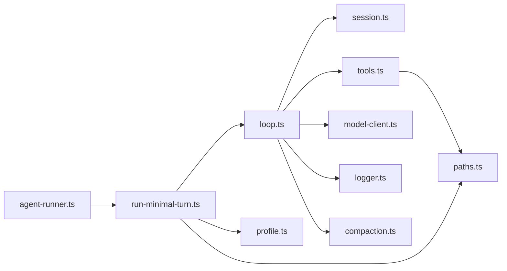

# Minimal harness (GrokForge)

Ampnet-style **single-profile** agent loop: `list_files`, `read_file`, `write_file`, **`edit`** (surgical patches), immediate disk writes, no edit proposals or plan routing.

**Manifest `context.customInstructions` is not used** in minimal mode (legacy copy in `project.json` stays for when you switch harnesses off).

## Enable

```bash
GROKFORGE_MINIMAL_HARNESS=1 npm run dev
```

`agent-runner.ts` delegates to `runMinimalAgentTurn` when the flag is set. Legacy harness code stays in the repo but is not executed.

## How modules connect



| File | Role |
|------|------|
| `config.ts` | Env flag, iteration cap |
| `profile.ts` | Work profile, system prompt, IPC routing metadata |
| `paths.ts` | Single workspace root (v0) + path guard |
| `tools.ts` | Tool schemas + execution |
| `session.ts` | Message history + JSONL under `minimal/sessions/` |
| `loop.ts` | Model ↔ tools loop |
| `model-client.ts` | xAI chat completions + token usage |
| `compaction.ts` | Summarize old messages when history is long |
| `logger.ts` | JSONL under `minimal/logs/` |
| `run-minimal-turn.ts` | IPC events, activities, final stream |
| `DEFERRED-FEATURES.md` | What we removed and re-entry order |
| `PROMPT-VISIBILITY.md` | What is logged vs future UI |

## Storage layout (per project)

```
userData/workspace-projects/<projectId>/minimal/
  logs/<streamId>.jsonl      # turn trace (prompts, tokens, tools)
  sessions/<streamId>.jsonl  # message history for compaction
```

## Deferred / follow-up

- **Multi-root** — see `DEFERRED-FEATURES.md` (priority after harness is stable)
- **Prompt inspector UI** — logs exist; renderer panel is separate work (`PROMPT-VISIBILITY.md`)
